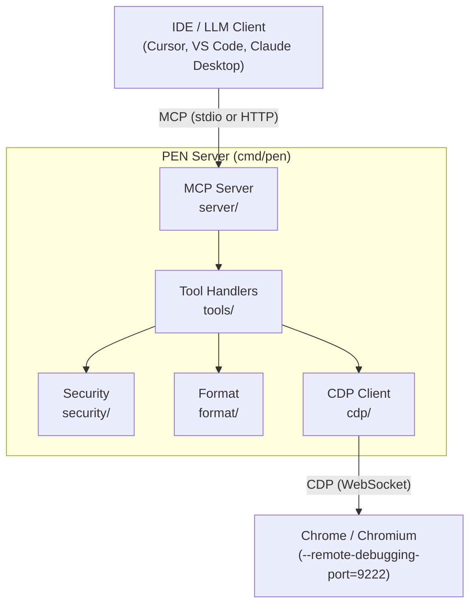
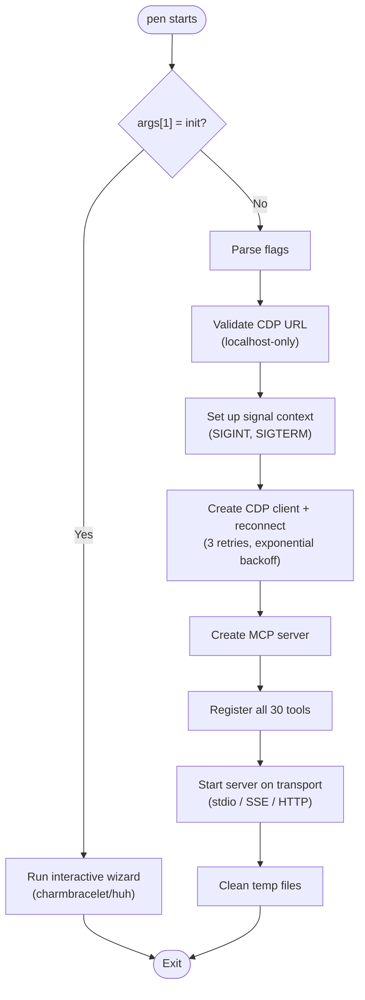
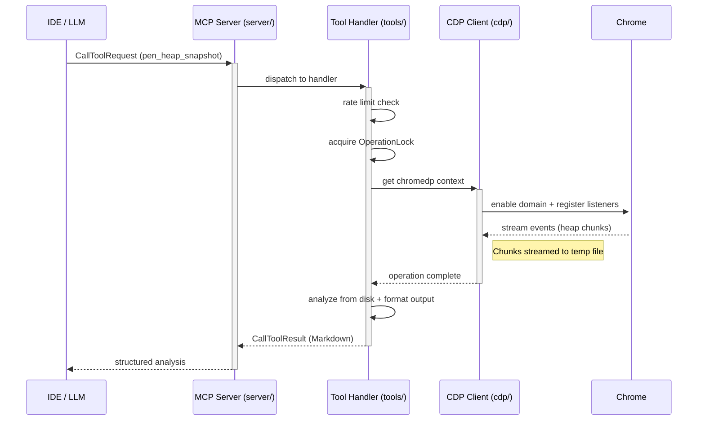

# System Architecture

## Component Overview



## Package Map

```
cmd/pen/
  main.go           Entry point. Flag parsing, signal handling, wiring.
  init.go           Interactive setup wizard (pen init) using charmbracelet/huh.

internal/
  cdp/
    client.go       CDP connection lifecycle (Connect, Reconnect, Close).
    listener.go     Event listener registration (ListenTarget wrapper).
    targets.go      Tab listing and switching (ListTargets, SelectTarget, FindTargetByURL).

  server/
    server.go       MCP server creation, transport handling (stdio/sse/http).
    lock.go         Domain-exclusive locking (OperationLock).
    progress.go     MCP progress notification helper.

  tools/
    register.go     Tool registration entry point (RegisterAll + Deps struct).
    audit.go        pen_performance_metrics, pen_web_vitals, pen_accessibility_check.
    memory.go       pen_heap_snapshot, pen_heap_diff, pen_heap_track, pen_heap_sampling.
    cpu.go          pen_cpu_profile, pen_capture_trace, pen_trace_insights.
    network.go      pen_network_enable, pen_network_waterfall, pen_network_request, pen_network_blocking.
    coverage.go     pen_js_coverage, pen_css_coverage.
    source.go       pen_list_sources, pen_source_content, pen_search_source.
    console.go      pen_console_enable, pen_console_messages.
    lighthouse.go   pen_lighthouse.
    utility.go      pen_list_pages, pen_select_page, pen_collect_garbage, pen_screenshot,
                    pen_emulate, pen_navigate, pen_evaluate.
    status.go       pen_status.

  format/
    output.go       Markdown table builder and formatting helpers.

  security/
    validate.go     Expression filtering, path traversal, CDP URL validation, temp files.
    ratelimit.go    Per-tool cooldown enforcement.
```

## Dependencies

| Dependency                               | Version | Purpose                                  |
| ---------------------------------------- | ------- | ---------------------------------------- |
| `github.com/modelcontextprotocol/go-sdk` | v1.3.1  | MCP server, transports, types            |
| `github.com/chromedp/chromedp`           | v0.13.6 | CDP connection and browser automation    |
| `github.com/chromedp/cdproto`            | pinned  | Auto-generated CDP type bindings         |
| `github.com/charmbracelet/huh`           | v1.0.0  | Interactive terminal wizard (`pen init`) |
| `github.com/charmbracelet/lipgloss`      | v1.1.0  | Terminal styling for `pen init` output   |

Go version: **1.24.2**. No other runtime dependencies beyond the standard library.

## Entry Point Flow

From `cmd/pen/main.go`:



1. Check for `"init"` subcommand → runs interactive wizard via `charmbracelet/huh`
2. Parse flags (`--cdp-url`, `--transport`, `--addr`, `--allow-eval`, `--project-root`, `--log-level`)
3. Validate CDP URL via `security.ValidateCDPURL` (localhost-only)
4. Set up signal context (`SIGINT`, `SIGTERM`)
5. Create CDP client with retry: `cdp.NewClient(url, logger)` → `client.Reconnect(ctx, 3)` (3 attempts, exponential backoff 500ms → 10s max)
6. Create MCP server: `server.New(cdpClient, &Config{...})`
7. Register all 30 tools: `tools.RegisterAll(server.Server(), deps)`
8. Start server with configured transport
9. Clean up temp directory on exit (deferred)

## Data Flow

A typical tool call flows through these layers:



## Key Type Signatures

### CDP Client

```go
type Client struct { /* unexported fields */ }

func NewClient(debugURL string, logger *slog.Logger) *Client
func (c *Client) Connect(ctx context.Context) error
func (c *Client) Close()
func (c *Client) Reconnect(ctx context.Context, maxAttempts int) error
func (c *Client) IsConnected() bool

// Context access
func (c *Client) Context() (context.Context, error)
func (c *Client) ContextWithTimeout(timeout time.Duration) (context.Context, context.CancelFunc, error)
func (c *Client) AllocContext() (context.Context, error)

// Actions
func (c *Client) RunAction(ctx context.Context, actions ...chromedp.Action) error
func (c *Client) RunActionFunc(fn func(ctx context.Context) error) error
func (c *Client) Listen(handler func(ev interface{})) (context.CancelFunc, error)

// Target management
func (c *Client) ListTargets(ctx context.Context) ([]TargetInfo, error)
func (c *Client) SelectTarget(ctx context.Context, targetID string) (context.Context, context.CancelFunc, error)
func (c *Client) FindTargetByURL(ctx context.Context, urlPattern string) (*TargetInfo, error)
func (c *Client) CurrentTargetID() string

// Discovery
func DiscoverEndpoint(ctx context.Context, baseURL string) (string, error)
```

### MCP Server

```go
type Config struct {
    Name      string
    Version   string
    Transport string
    HTTPAddr  string
    AllowEval bool
    Logger    *slog.Logger
}

type PEN struct { /* unexported fields */ }
func New(cdpClient *cdp.Client, cfg *Config) *PEN
func (p *PEN) Server() *mcp.Server
func (p *PEN) CDP() *cdp.Client
func (p *PEN) Locks() *OperationLock
func (p *PEN) Run(ctx context.Context) error
```

### Tool Registration

```go
type Deps struct {
    CDP     *cdp.Client
    Locks   *server.OperationLock
    Limiter *security.RateLimiter
    Config  *ToolsConfig
}

type ToolsConfig struct {
    AllowEval   bool
    ProjectRoot string
    Version     string
    CDPPort     int
}

func RegisterAll(s *mcp.Server, deps *Deps)
```

### Security

```go
type RateLimiter struct { /* unexported fields */ }
func NewRateLimiter(cooldowns map[string]time.Duration) *RateLimiter
func (rl *RateLimiter) Check(toolName string) error
func (rl *RateLimiter) Record(toolName string)

func ValidateExpression(expr string) error
func ValidateSourcePath(projectRoot, requestedPath string) (string, error)
func ValidateTempPath(path string) error
func ValidateCDPURL(rawURL string) error
func CreateSecureTempFile(prefix string) (*os.File, error)
func CleanTempFiles() (int64, error)
```

### Format

```go
func Table(headers []string, rows [][]string) string
func Section(title string, parts ...string) string
func Bytes(n int64) string
func Duration(d time.Duration) string
func Percent(pct float64) string
func BulletList(items []string) string
func Warning(msg string) string
func KeyValue(key, value string) string
func Summary(pairs [][2]string) string
func ToolResult(title string, sections ...string) string
```

### Operation Lock

```go
type OperationLock struct { /* unexported fields */ }
func NewOperationLock() *OperationLock
func (ol *OperationLock) Acquire(domain string) (release func(), err error)
func (ol *OperationLock) IsLocked(domain string) bool
```

## Concurrency Model

### Domain-Exclusive Locking

Tools that use conflicting CDP domains are protected by `OperationLock`:

```go
release, err := deps.Locks.Acquire("HeapProfiler")
if err != nil {
    return toolError("HeapProfiler is already in use by another operation")
}
defer release()
```

The lock is a per-domain mutex. If a second tool tries to acquire a locked domain, it returns an immediate error — PEN never queues or waits.

### Rate Limiting

Per-tool cooldowns enforced before execution:

```go
if err := deps.Limiter.Check("pen_heap_snapshot"); err != nil {
    return toolError(err.Error()) // "pen_heap_snapshot has a 10s cooldown. Try again in 6s"
}
```

### Context Propagation

Every handler receives `context.Context` from MCP. If the client disconnects mid-operation:

1. `ctx.Done()` fires
2. CDP operations abort (chromedp respects context)
3. Temp files cleaned via `defer`
4. Domain locks released via `defer`
5. No dangling goroutines — chromedp's context tree handles cleanup

## Build

```bash
go build -ldflags "-s -w -X main.version=v1.0.0" -o pen ./cmd/pen
```

Cross-compiled via GoReleaser for:

- `linux/amd64`, `linux/arm64`
- `darwin/amd64`, `darwin/arm64`
- `windows/amd64`

## Constants and Limits

| Constant                      | Value           | Location               |
| ----------------------------- | --------------- | ---------------------- |
| Max console entries           | 1,000           | `tools/console.go`     |
| Console eviction batch        | 100 (oldest)    | `tools/console.go`     |
| Max debugger scripts          | 500             | `tools/source.go`      |
| Max heap snapshots retained   | 20              | `tools/memory.go`      |
| Console text truncation       | 2,000 chars     | `tools/console.go`     |
| Trace file max size           | 100 MB          | `tools/cpu.go`         |
| CPU profile duration          | 1–30 seconds    | `tools/cpu.go`         |
| CPU sampling interval min     | 10 µs           | `tools/cpu.go`         |
| Default coverage topN         | 20              | `tools/coverage.go`    |
| Network large asset threshold | 100 KB          | `tools/network.go`     |
| Default waterfall limit       | 50 requests     | `tools/network.go`     |
| Long task threshold           | 50 ms           | `tools/cpu.go`         |
| Frame drop threshold          | 33.3 ms (30fps) | `tools/cpu.go`         |
| Heap sampling interval        | 32,768 bytes    | `tools/memory.go`      |
| Default trace categories      | 6 categories    | `tools/cpu.go`         |
| Temp dir permissions          | 0700            | `security/validate.go` |
| Temp file permissions         | 0600            | `security/validate.go` |
