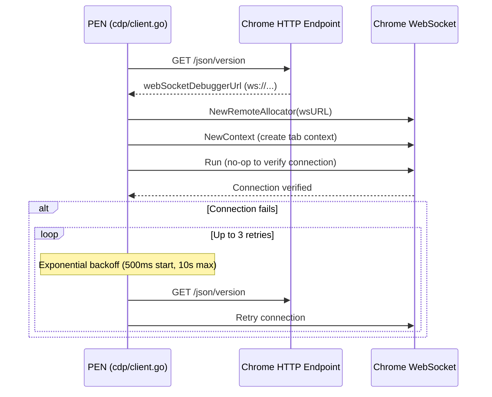

# CDP Integration

PEN talks to Chrome through [chromedp](https://github.com/chromedp/chromedp) (v0.13.6), which wraps the Chrome DevTools Protocol over WebSocket.

## Connection Lifecycle

PEN attaches to a browser that’s already running. It never launches one.



### Endpoint Discovery

At startup, PEN hits the HTTP endpoint (usually `http://localhost:9222/json/version`) to get the browser’s WebSocket URL:

```go
func DiscoverEndpoint(ctx context.Context, httpURL string) (string, error)
```

This hands back a `ws://` URL like `ws://localhost:9222/devtools/browser/...` that chromedp uses to open the CDP session.

### Connection

```go
client := cdp.NewClient("http://localhost:9222", logger)
err := client.Reconnect(ctx, 3) // 3 retries with exponential backoff
```

Under the hood, `Connect` calls `DiscoverEndpoint`, sets up a `chromedp.NewRemoteAllocator`, opens a `chromedp.NewContext`, and verifies with a no-op `chromedp.Run`. If that fails, `Reconnect` retries with exponential backoff (500ms start, 10s cap).

### chromedp Remote Allocator

PEN uses chromedp’s remote allocator (not its default browser-launching mode):

```go
allocCtx, cancel := chromedp.NewRemoteAllocator(ctx, wsURL)
tabCtx, cancel := chromedp.NewContext(allocCtx)
chromedp.Run(tabCtx) // no-op to verify connection
```

This connects to an existing browser instead of spawning one. The allocator context owns the WebSocket; tab contexts own individual pages.

### Cleanup

`client.Close()` cancels the tab and allocator contexts. Called via `defer` in `main.go`. chromedp’s context tree cascades the cleanup — killing the allocator kills all child tabs.

## Event Listening

PEN registers CDP event listeners through a thin wrapper over `chromedp.ListenTarget`:

```go
func (c *Client) Listen(handler func(ev interface{})) (context.CancelFunc, error)
```

Tool handlers type-switch on events. For instance, heap snapshot streaming catches `heapProfiler.AddHeapSnapshotChunk` events and writes each chunk straight to a temp file.

The listener pattern from chromedp:

```go
chromedp.ListenTarget(ctx, func(ev interface{}) {
    switch ev := ev.(type) {
    case *runtime.EventConsoleAPICalled:
        // handle console message
    case *runtime.EventExceptionThrown:
        // handle exception
    case *heapprofiler.EventAddHeapSnapshotChunk:
        // write chunk to temp file
    }
})
```

## Tab Management

### Listing Targets

```go
targets, err := client.ListTargets(ctx)
```

Returns `[]TargetInfo` with ID, type, title, and URL for each target. Powers `pen_list_pages`.

### Switching Targets

```go
tabCtx, cancel, err := client.SelectTarget(ctx, targetID)
```

Creates a new `chromedp.NewContext` with `chromedp.WithTargetID`, checks it’s reachable, and updates the active context. Powers `pen_select_page`.

### Finding by URL

```go
target, err := client.FindTargetByURL(ctx, urlPattern)
```

Finds a target by URL substring. Used internally when a tool takes `urlPattern` instead of `targetId`.

## CDP Domains Used

| Domain       | Tools                                                                                              | Exclusive? |
| ------------ | -------------------------------------------------------------------------------------------------- | ---------- |
| HeapProfiler | `pen_heap_snapshot`, `pen_heap_diff`, `pen_heap_track`, `pen_heap_sampling`, `pen_collect_garbage` | Yes        |
| Profiler     | `pen_cpu_profile`, `pen_js_coverage`                                                               | Yes        |
| Tracing      | `pen_capture_trace`                                                                                | Yes        |
| CSS          | `pen_css_coverage`                                                                                 | Yes        |
| Lighthouse   | `pen_lighthouse`                                                                                   | Yes        |
| Performance  | `pen_performance_metrics`                                                                          | No         |
| Network      | `pen_network_enable`, `pen_network_waterfall`, `pen_network_request`, `pen_network_blocking`       | No         |
| Page         | `pen_screenshot`, `pen_navigate`                                                                   | No         |
| Runtime      | `pen_evaluate`, `pen_web_vitals`, `pen_console_enable`, `pen_console_messages`                     | No         |
| Emulation    | `pen_emulate` (CPU throttling, network conditions)                                                 | No         |
| Debugger     | `pen_list_sources`, `pen_source_content`, `pen_search_source`                                      | No         |
| IO           | Trace streaming (`pen_capture_trace` uses `IO.read`/`IO.close` for stream data)                    | No         |
| DOM          | `pen_accessibility_check`                                                                          | No         |

"Exclusive" means PEN holds an `OperationLock` so two tools can’t fight over the same domain. If a second tool tries, it gets an immediate error explaining the conflict.

## Network Event Handling

PEN listens to four network event types from the Network CDP domain:

- `Network.requestWillBeSent` — request initiated
- `Network.responseReceived` — response headers received
- `Network.loadingFinished` — request completed successfully
- `Network.loadingFailed` — request failed

These are stored in an in-memory map keyed by request ID, used by `pen_network_waterfall` and `pen_network_request`.

## DevTools Coexistence

Chrome handles multiple CDP clients on one WebSocket. PEN can run alongside open DevTools, but watch out:

- Only one client can control the Tracing domain at a time
- HeapProfiler operations may conflict with DevTools Memory panel usage
- This is a Chrome limitation, not a PEN limitation

PEN’s internal locks prevent its own tools from colliding. External conflicts (e.g., DevTools Memory panel vs. PEN) show up as CDP errors, which PEN passes back to the LLM.
