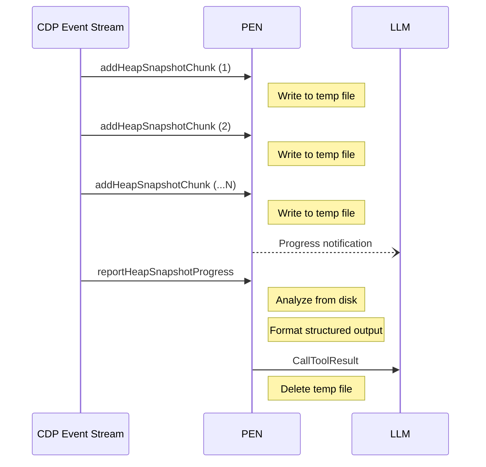

# Data Streaming

## Problem

Some CDP operations produce large payloads:

| Operation     | Typical Size | Worst Case |
| ------------- | ------------ | ---------- |
| Heap snapshot | 50–500 MB    | 2+ GB      |
| Chrome trace  | 5–50 MB      | 500+ MB    |
| CPU profile   | 100 KB–5 MB  | 20 MB      |
| Coverage data | 10–500 KB    | 5 MB       |

Holding these in memory would crash PEN or exhaust the host. PEN streams them to temp files on disk.

## Heap Snapshot Streaming

CDP delivers heap snapshots as a series of `HeapProfiler.addHeapSnapshotChunk` events, each carrying a string chunk of the JSON data.

```mermaid
sequenceDiagram
    participant Handler as Tool Handler
    participant Lock as OperationLock
    participant Temp as Temp File (disk)
    participant CDP as Chrome (CDP)
    participant MCP as MCP Client

    Handler->>+Lock: Acquire("HeapProfiler")
    Handler->>Temp: CreateSecureTempFile("heap-")
    Handler->>CDP: HeapProfiler.collectGarbage (optional)
    Handler->>CDP: HeapProfiler.takeHeapSnapshot

    loop Each chunk (constant memory)
        CDP-->>Handler: addHeapSnapshotChunk
        Handler->>Temp: Write chunk to disk
    end

    CDP-->>Handler: reportHeapSnapshotProgress
    Handler--)MCP: Progress notification

    Handler->>Temp: Seek to start, analyze from disk
    Handler-->>MCP: Return structured analysis
    Handler->>-Lock: Release
```

Memory usage stays constant regardless of heap size because chunks are written directly to disk.

## Trace Streaming

Chrome traces use `Tracing.start` with `transferMode: "ReturnAsStream"` and optional gzip compression.

```mermaid
sequenceDiagram
    participant Handler as Tool Handler
    participant Lock as OperationLock
    participant CDP as Chrome (CDP)
    participant Temp as Temp File (disk)

    Handler->>+Lock: Acquire("Tracing")
    Handler->>CDP: Tracing.start (categories, ReturnAsStream)

    Note over Handler: Wait for capture duration

    Handler->>CDP: Tracing.end
    CDP-->>Handler: tracingComplete (IO.StreamHandle)

    loop Until eof
        Handler->>CDP: IO.read(handle)
        CDP-->>Handler: chunk data
        Handler->>Temp: Write chunk
    end

    Handler->>Handler: Analyze trace file
    Handler->>-Lock: Release
```

### Buffer Management

Chrome has a finite trace buffer. PEN listens for `Tracing.bufferUsage` events during capture. If `percentFull > 0.9`, PEN sends a progress warning. If the buffer fills completely, the trace is truncated and PEN notes this in the output.

## Temp File Lifecycle

All temp files live under `os.TempDir()/pen/`:

- Created with `0600` permissions (owner-only read/write)
- Directory created with `0700` permissions
- Path validated via `security.ValidateTempPath` before any read/write
- Cleaned up on normal exit via `security.CleanTempFiles()` in `main.go`
- Cleaned up on context cancellation via `defer` in each handler

Each temp file has a prefix indicating its type (`heap-`, `trace-`, etc.) and a unique suffix generated by `os.CreateTemp`.

## Progress Notifications

Long-running operations send MCP progress notifications:

```go
server.NotifyProgress(ctx, req, bytesWritten, totalBytes, "streaming heap snapshot...")
```

This only fires if the MCP client provided a progress token in the request. Safe to call unconditionally — a nil token or nil session is a no-op.

## Data Flow Diagram


