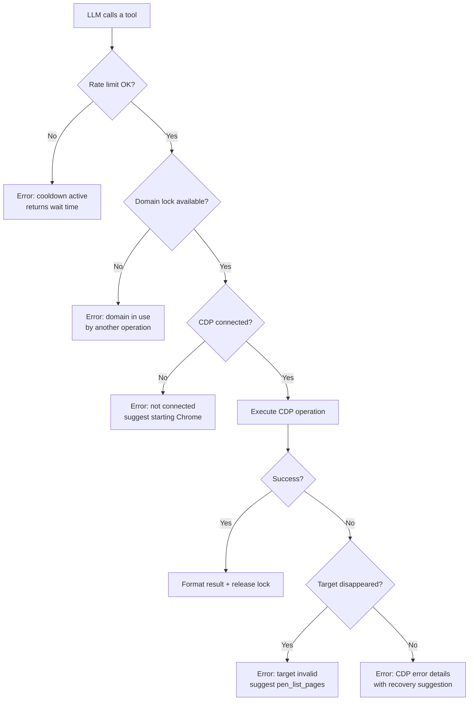

# Error Handling & Edge Cases

How PEN handles failures across CDP, MCP, and browser interactions.



## CDP Connection Errors

### Browser Not Running

If PEN can't connect to `--remote-debugging-port`:

```
pen: cannot reach Chrome at ws://127.0.0.1:9222
Start Chrome with: chrome --remote-debugging-port=9222
```

**What happens internally**: `chromedp.NewRemoteAllocator` fails → PEN exits with a non-zero code before starting the MCP server.

### Browser Disconnects Mid-Session

If Chrome closes while PEN is running:

1. The underlying WebSocket drops
2. CDP calls return `context.Canceled`
3. PEN wraps the error and returns it to the LLM
4. PEN does **not** crash — it remains running and reports the error

The LLM can instruct the user to restart Chrome and reconnect.

### Target Disappears

If a tab is closed while a tool is operating on it:

- The active CDP context becomes invalid
- Subsequent CDP calls on that target fail
- `pen_list_pages` still works (it queries the browser, not a specific target)
- The LLM should call `pen_list_pages` → `pen_select_page` to switch to a valid target

## Network & Resource Errors

### Large Payloads

Network response bodies can be very large. PEN handles this:

| Scenario               | Handling                                       |
| ---------------------- | ---------------------------------------------- |
| Response body > limit  | Truncated with `[truncated at N bytes]` suffix |
| Binary response        | Not captured (only text-based MIME types)      |
| Streaming response     | Captured when complete                         |
| No response (canceled) | Marked as `(canceled)` in waterfall            |

### Source Map Failures

`pen_source_content` may encounter missing or invalid source maps:

- **Missing source map**: PEN serves the minified source as-is
- **Invalid source map URL**: Logged and skipped, minified source returned
- **Cross-origin source map**: Cannot be fetched via CDP; minified source returned

PEN does not fail on source map issues — it degrades gracefully.

## MCP Protocol Errors

### Invalid Parameters

If the LLM sends invalid parameters (wrong type, missing required field):

- The MCP SDK validates against the JSON Schema
- Returns a standard MCP error with code `-32602` (Invalid params)
- PEN tool handlers also validate inputs and return descriptive `CallToolResult` errors

### Unknown Tool

If the LLM calls a tool that doesn't exist:

- The MCP SDK returns code `-32601` (Method not found)
- No PEN code is involved

### Concurrent Tool Calls

The MCP protocol allows concurrent tool calls. PEN handles this with `OperationLock`:

```go
type OperationLock struct {
    mu    sync.Mutex
    locks map[string]struct{} // domain → lock
}
```

Locks are keyed by CDP domain — multiple tools can run concurrently as long as they use different domains. If two tools that need the same exclusive CDP domain are called simultaneously:

1. The first caller acquires the domain lock
2. The second caller gets an immediate error: _"HeapProfiler is already in use by another operation. Wait for the current heap snapshot to finish, or call another tool in the meantime."_
3. The error is returned as a `CallToolResult`, not an MCP protocol error

Exclusive domains and their tools:

| Domain                | Tools                                                                     |
| --------------------- | ------------------------------------------------------------------------- |
| `HeapProfiler`        | `pen_heap_snapshot`, `pen_heap_diff`                                      |
| `HeapProfiler.tracking` | `pen_heap_track`                                                       |
| `Profiler`            | `pen_cpu_profile`, `pen_js_coverage`                                      |
| `Tracing`             | `pen_capture_trace`                                                       |
| `CSS`                 | `pen_css_coverage`                                                        |
| `Lighthouse`          | `pen_lighthouse`                                                          |

Tools that **don't** need a lock: `pen_console_messages`, `pen_list_pages`, `pen_select_page`, `pen_screenshot`, `pen_network_waterfall`, `pen_performance_metrics`, `pen_web_vitals`, `pen_accessibility_check`, `pen_status`.

## Rate Limiting

PEN applies per-tool cooldown-based rate limiting:

```go
type RateLimiter struct {
    mu        sync.Mutex
    lastCalls map[string]time.Time
    cooldowns map[string]time.Duration
}
```

Each rate-limited tool has a minimum cooldown period between invocations:

| Tool                  | Cooldown |
| --------------------- | -------- |
| `pen_heap_snapshot`   | 10s      |
| `pen_capture_trace`   | 5s       |
| `pen_collect_garbage` | 5s       |

When a tool is called within its cooldown window, `Check` returns an error with the remaining wait time (e.g., _"pen_heap_snapshot has a 10s cooldown. Try again in 6s"_). All other tools have no cooldown.

Rate limits protect against resource exhaustion from runaway LLM loops.

## Input Validation

All tool inputs are validated at the boundary:

| Check           | Scope                | Example                            |
| --------------- | -------------------- | ---------------------------------- |
| URL scheme      | `pen_navigate`       | Only `http://`, `https://` allowed |
| Path traversal  | `pen_source_content` | No `../` sequences                 |
| Integer bounds  | Various              | `topN` must be > 0                 |
| String length   | Various              | URLs capped at 2048 chars          |
| Required fields | All tools            | Schema-enforced by MCP SDK         |

Validation functions live in `internal/security/validate.go`.

## Heap Profiling Edge Cases

### Snapshot While Navigating

If `pen_heap_snapshot` is called during a navigation:

- The snapshot may capture a partially-constructed heap
- PEN does not prevent this — the result will be returned with whatever state the heap is in
- For accurate snapshots, the LLM should wait for navigation to complete

### Diff With Mismatched Snapshots

`pen_heap_diff` compares two snapshot IDs. Edge cases:

- **Same snapshot twice**: Returns a diff of zero changes
- **Invalid snapshot ID**: Returns an error
- **Snapshot from different page**: Works, but the diff may not be meaningful

## Lighthouse Edge Cases

### Lighthouse Cache

`pen_lighthouse` runs Chrome's built-in Lighthouse. Considerations:

- First run may be slower (cold cache)
- Results vary between runs (network timing, CPU load)
- PEN returns the raw Lighthouse scores without averaging

### Page Requires Authentication

If the current page requires authentication:

- Lighthouse navigates the page fresh, losing session state
- Scores reflect the unauthenticated page (often a login redirect)
- The LLM should ensure the user is logged in and has navigated to the target page

## Console Overflow

`pen_console_messages` stores messages in memory:

- Messages accumulate from page load onward
- A `last` parameter limits how many are returned (max 200)
- Clearing: use `pen_console_messages` with `clear=true` to reset the buffer
- Very noisy pages (thousands of messages) may use significant memory

## Trace Collection Edge Cases

### Trace File Size

Trace files are written to a temp directory:

- Small pages: 1-5 MB
- Complex SPA: 10-50 MB
- Long-running traces: 100+ MB possible

`pen_capture_trace` accepts a `duration` parameter (default: 5 seconds). Keep it short for manageable file sizes.

### Temp File Cleanup

Trace files are stored in `os.TempDir()`:

- PEN does not clean them up automatically
- They persist until the OS clears temp files or the user removes them
- The file path is returned to the LLM, which can inform the user

## Recovery Patterns

When PEN encounters an error, it follows these principles:

1. **Never crash**: PEN stays running. Errors are returned as tool results.
2. **Be specific**: Error messages include what happened and what to do next.
3. **Degrade gracefully**: Partial results are better than no results (e.g., truncated payloads, missing source maps).
4. **Reset state**: Operations clean up after themselves, even on failure (defer patterns in Go).
5. **Let the LLM decide**: PEN reports the problem. The LLM decides what to try next.
