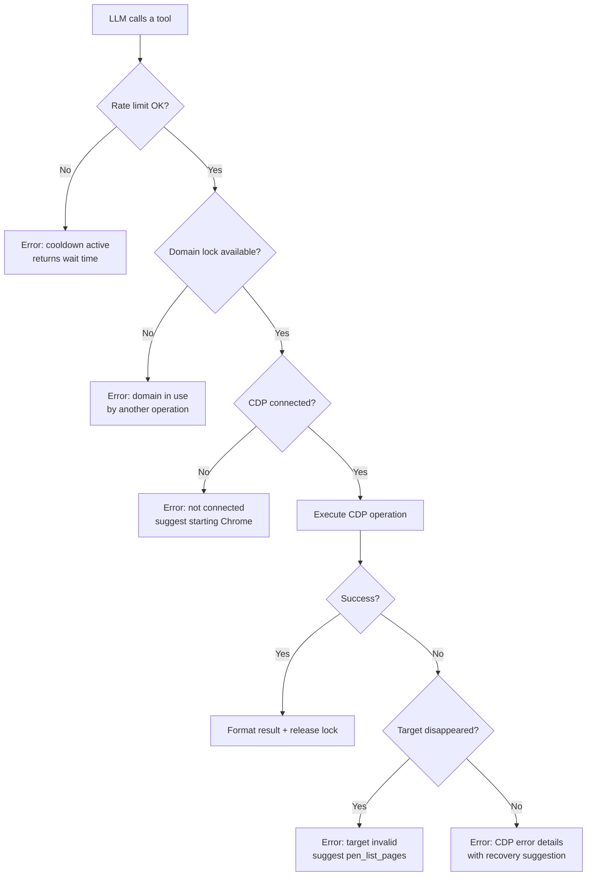

# Error Handling & Edge Cases

How PEN deals with failures across CDP, MCP, and browser interactions.



## CDP Connection Errors

### Browser Not Running

If PEN can’t reach `--remote-debugging-port`:

```
pen: cannot reach Chrome at ws://127.0.0.1:9222
Start Chrome with: chrome --remote-debugging-port=9222
```

**What happens:** `chromedp.NewRemoteAllocator` fails → PEN exits with a non-zero code before the MCP server even starts.

### Browser Disconnects Mid-Session

If Chrome dies while PEN is running:

1. The WebSocket drops
2. CDP calls come back with `context.Canceled`
3. PEN wraps the error and sends it to the LLM
4. PEN itself stays up — it doesn’t crash

The LLM can tell the user to restart Chrome.

### Target Disappears

If a tab gets closed while a tool is working on it:

- The active CDP context goes stale
- CDP calls on that target start failing
- `pen_list_pages` still works (it queries the browser, not a specific tab)
- The LLM should call `pen_list_pages` → `pen_select_page` to pick a live target

## Network & Resource Errors

### Large Payloads

Network response bodies can be big. Here’s how PEN handles the edge cases:

| Scenario               | Handling                                       |
| ---------------------- | ---------------------------------------------- |
| Response body > limit  | Truncated with `[truncated at N bytes]` suffix |
| Binary response        | Not captured (only text-based MIME types)      |
| Streaming response     | Captured when complete                         |
| No response (canceled) | Marked as `(canceled)` in waterfall            |

### Source Map Failures

`pen_source_content` may hit missing or busted source maps:

- **Missing source map**: PEN serves the minified source as-is
- **Bad source map URL**: Logged, skipped, minified source returned
- **Cross-origin source map**: Can’t fetch via CDP; minified source returned

PEN doesn’t blow up on source map problems — it degrades gracefully.

## MCP Protocol Errors

### Invalid Parameters

If the LLM sends bad parameters (wrong type, missing required field):

- The SDK validates against the JSON Schema
- Returns MCP error code `-32602` (Invalid params)
- PEN handlers also validate and return descriptive errors

### Unknown Tool

If the LLM calls a tool that doesn’t exist:

- The SDK returns code `-32601` (Method not found)
- PEN code isn’t involved

### Concurrent Tool Calls

MCP allows concurrent tool calls. PEN handles this with `OperationLock`:

```go
type OperationLock struct {
    mu    sync.Mutex
    locks map[string]struct{} // domain → lock
}
```

Locks are keyed by CDP domain — tools that use different domains can run in parallel. If two tools need the same exclusive domain at once:

1. The first caller acquires the domain lock
2. The second caller gets an immediate error: _"HeapProfiler is already in use by another operation. Wait for the current heap snapshot to finish, or call another tool in the meantime."_
3. The error is returned as a `CallToolResult`, not an MCP protocol error

Exclusive domains and their tools:

| Domain                  | Tools                                |
| ----------------------- | ------------------------------------ |
| `HeapProfiler`          | `pen_heap_snapshot`, `pen_heap_diff` |
| `HeapProfiler.tracking` | `pen_heap_track`                     |
| `Profiler`              | `pen_cpu_profile`, `pen_js_coverage` |
| `Tracing`               | `pen_capture_trace`                  |
| `CSS`                   | `pen_css_coverage`                   |
| `Lighthouse`            | `pen_lighthouse`                     |

Tools that **don't** need a lock: `pen_console_messages`, `pen_list_pages`, `pen_select_page`, `pen_screenshot`, `pen_network_waterfall`, `pen_performance_metrics`, `pen_web_vitals`, `pen_accessibility_check`, `pen_status`.

## Rate Limiting

PEN applies per-tool cooldown-based rate limiting:

```go
type RateLimiter struct {
    mu        sync.Mutex
    lastCalls map[string]time.Time
    cooldowns map[string]time.Duration
}
```

Each rate-limited tool has a minimum gap between calls:

| Tool                  | Cooldown |
| --------------------- | -------- |
| `pen_heap_snapshot`   | 10s      |
| `pen_capture_trace`   | 5s       |
| `pen_collect_garbage` | 5s       |

When a call lands inside the cooldown window, `Check` returns an error with the remaining wait time (e.g., _"pen_heap_snapshot has a 10s cooldown. Try again in 6s"_). Everything else has no cooldown.

Rate limits exist to stop runaway LLM loops from hammering expensive operations.

## Input Validation

All tool inputs are validated at the boundary:

| Check           | Scope                | Example                            |
| --------------- | -------------------- | ---------------------------------- |
| URL scheme      | `pen_navigate`       | Only `http://`, `https://` allowed |
| Path traversal  | `pen_source_content` | No `../` sequences                 |
| Integer bounds  | Various              | `topN` must be > 0                 |
| String length   | Various              | URLs capped at 2048 chars          |
| Required fields | All tools            | Schema-enforced by MCP SDK         |

Validation functions live in `internal/security/validate.go`.

## Heap Profiling Edge Cases

### Snapshot During Navigation

If `pen_heap_snapshot` fires during a page navigation:

- The snapshot might catch a half-built heap
- PEN doesn’t prevent this — you get whatever state the heap is in
- For clean snapshots, wait for navigation to finish

### Diffing Mismatched Snapshots

`pen_heap_diff` compares two snapshot IDs. Some edge cases:

- **Same snapshot twice**: Returns zero changes
- **Bad snapshot ID**: Returns an error
- **Snapshot from a different page**: Works, but the diff probably won’t mean much

## Lighthouse Edge Cases

### Lighthouse Caching

`pen_lighthouse` runs Lighthouse via Chrome. Keep in mind:

- First run can be slow (cold cache)
- Scores fluctuate between runs (network jitter, CPU load)
- PEN returns raw scores, no averaging

### Page Requires Authentication

If the page needs a login:

- Lighthouse navigates fresh, losing the session
- You’ll get scores for the login redirect, not the actual page
- Make sure the user is already logged in and on the right page

## Console Buffer

`pen_console_messages` keeps messages in memory:

- Messages pile up from page load onward
- The `last` param caps how many come back (max 200)
- Use `clear=true` to flush the buffer
- Noisy pages (thousands of logs) can eat memory

## Trace Collection Edge Cases

### Trace File Size

Trace files land in the temp directory:

- Small pages: 1–5 MB
- Complex SPAs: 10–50 MB
- Long recordings: 100+ MB is possible

`pen_capture_trace` takes a `duration` param (default: 5s). Keep it short for sane file sizes.

### Temp File Cleanup

Trace files live in `os.TempDir()`:

- PEN doesn’t auto-delete them
- They stick around until the OS cleans temp or you remove them manually
- The file path is returned to the LLM, which can let the user know

## Recovery Patterns

When something goes wrong, PEN follows these rules:

1. **Never crash**: PEN stays up. Errors go back as tool results.
2. **Be specific**: Say what happened and what to do about it.
3. **Degrade gracefully**: Partial results beat no results (truncated payloads, missing source maps, etc.).
4. **Clean up after yourself**: Every operation resets its own state, even on failure (`defer` in Go).
5. **Let the LLM decide**: PEN reports the problem. The LLM figures out what’s next.
