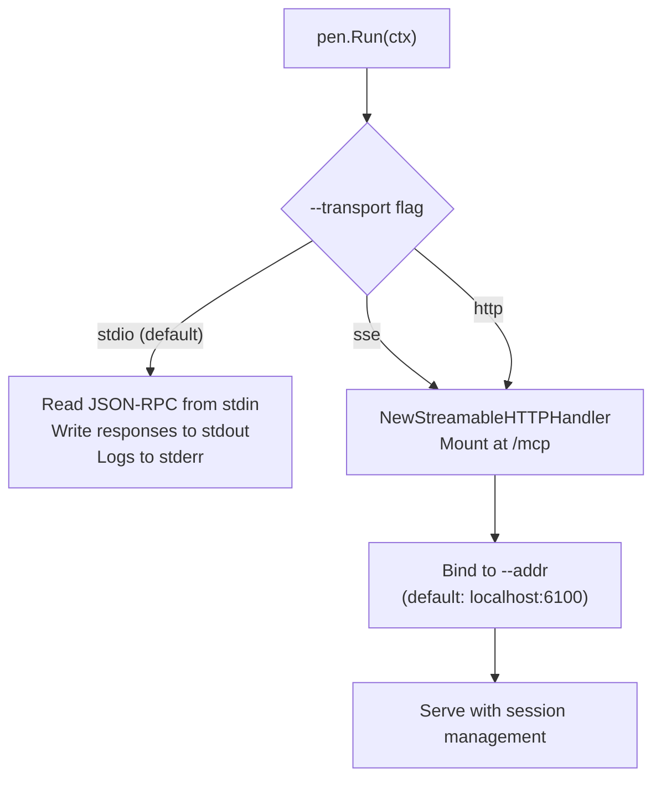

# MCP Server Design

PEN implements the [Model Context Protocol](https://spec.modelcontextprotocol.io/2025-03-26/) with the [MCP Go SDK](https://github.com/modelcontextprotocol/go-sdk) v1.3.1.

## Server Initialization

PEN creates the MCP server with an identity header and a few key options:

```go
srv := mcp.NewServer(
    &mcp.Implementation{Name: "pen", Version: version},
    &mcp.ServerOptions{
        Logger:       logger,
        Instructions: "PEN is an autonomous performance engineer for web applications. Use pen_ tools to profile, analyze, and debug frontend performance.",
        KeepAlive:    30 * time.Second,
        InitializedHandler: func(ctx context.Context, _ *mcp.InitializedRequest) {
            logger.Info("MCP client connected and initialized")
        },
    },
)
```

**What matters here:**

- `Instructions` tells the LLM what PEN is and how to use it. Sent during the `initialize` handshake.
- `KeepAlive` pings the transport periodically to catch dead sessions.
- `InitializedHandler` fires once the client finishes the handshake.

## Tool Registration

All 30 tools are registered at startup via `tools.RegisterAll`:

```go
tools.RegisterAll(pen.Server(), &tools.Deps{
    CDP:     cdpClient,
    Locks:   pen.Locks(),
    Limiter: security.NewRateLimiter(security.DefaultCooldowns),
    Config:  &tools.ToolsConfig{
        AllowEval:   *allowEval,
        ProjectRoot: *projectRoot,
        Version:     version,
    },
})
```

The `Deps` struct bundles everything handlers need — no globals anywhere. Tools are grouped by category (`registerMemoryTools`, `registerCPUTools`, etc.).

### Typed Generic Handlers

The MCP Go SDK uses Go generics for type-safe tool handlers:

```go
mcp.AddTool[InputType, any](server, toolDefinition, handlerFunc)
```

Where `InputType` is a Go struct with `jsonschema` tags. The SDK builds the `inputSchema` from these tags automatically. Handlers get the unmarshaled input directly — no manual JSON parsing.

### Handler Signature

Every tool handler follows this pattern:

```go
func makeToolHandler(deps *Deps) func(context.Context, *mcp.CallToolRequest, InputType) (*mcp.CallToolResult, any, error)
```

The return values:

- `*mcp.CallToolResult` — structured response with `Content` (text, images)
- `any` — unused (reserved for future SDK use)
- `error` — sets `isError: true` on the MCP response

## Transports

PEN supports three MCP transports:



| Transport | Flag                          | Use Case                            |
| --------- | ----------------------------- | ----------------------------------- |
| stdio     | `--transport stdio` (default) | IDE spawns PEN as child process     |
| SSE       | `--transport sse`             | Browser-based or remote clients     |
| HTTP      | `--transport http`            | Streamable HTTP (stateful sessions) |

Both `sse` and `http` use `mcp.NewStreamableHTTPHandler` internally, mounted at `/mcp`. Default bind: `localhost:6100`.

### stdio Transport

The default. PEN reads JSON-RPC messages from stdin and writes responses to stdout. Logs go to stderr. This is how IDEs (VS Code, Cursor, Claude Desktop) communicate with PEN — they spawn it as a child process.

### HTTP / SSE Transport

For network-accessible use:

```bash
pen --transport http --addr localhost:6100
```

Serves MCP at `http://localhost:6100/mcp`. The handler manages stateful sessions — each client gets its own session context.

## Error Handling

Tool errors return through the SDK's error mechanism:

```go
func toolError(msg string) (*mcp.CallToolResult, any, error) {
    return nil, nil, errors.New(msg)
}
```

The SDK sets `isError: true` on the response automatically. Errors are written for LLM consumption — they explain what went wrong and what to try next.

Example: _"HeapProfiler is already in use by another operation. Wait for the current heap snapshot to finish, or call another tool in the meantime."_

## Concurrency

### OperationLock

Domain-exclusive locking prevents conflicting CDP operations:

```go
release, err := deps.Locks.Acquire("HeapProfiler")
if err != nil {
    return toolError("HeapProfiler is already in use by another operation")
}
defer release()
```

The lock never spans async boundaries — `defer release()` guarantees cleanup even on panics.

### Rate Limiting

Heavy tools have cooldowns enforced before execution:

```go
if err := deps.Limiter.Check("pen_heap_snapshot"); err != nil {
    return toolError(err.Error())
}
```

The limiter tracks the last execution time per tool. `Record` is called after successful execution.

### Context Cancellation

Every handler respects `ctx.Done()`. If the client bails mid-operation, CDP calls cancel, temp files clean up via `defer`, and domain locks release.

## Capabilities

PEN declares standard MCP server capabilities during the `initialize` handshake:

- **Tools**: Full `tools/list` and `tools/call` support
- **Progress**: Sends `notifications/progress` for slow operations (heap snapshots, traces)
- **No resources or prompts**: PEN is tools-only — no MCP resources or prompt templates

## `pen init` — Interactive Setup

PEN ships with an interactive setup wizard via `pen init`, built with:

- **[charmbracelet/huh](https://github.com/charmbracelet/huh) v1.0.0** — terminal form framework for the multi-step wizard
- **[charmbracelet/lipgloss](https://github.com/charmbracelet/lipgloss) v1.1.0** — terminal styling for formatted output
- **charmbracelet/huh/spinner** — loading animations during connection verification

The wizard sniffs out installed browsers and IDE configs, then writes the right MCP config file. It’s the best way to get started.
