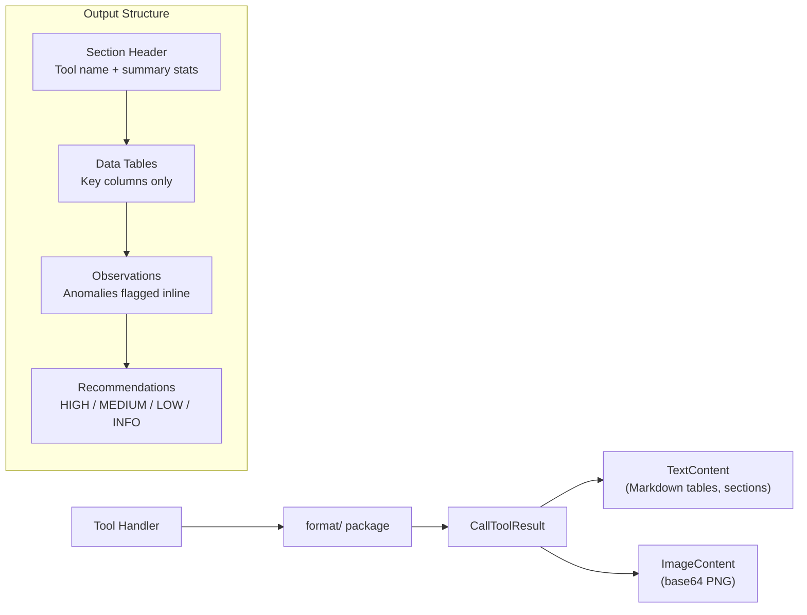

# Output Design

How PEN formats what it sends back to the LLM.

## Principles

Every tool returns text in `CallToolResult.Content`. The text is shaped for LLMs first, humans second.



### Constraints

- **Token budget**: Output is capped to fit LLM context windows. Big result sets (e.g., 500 network requests) get trimmed to the top N.
- **No binary blobs**: Everything is text. Screenshots are base64 PNGs in `mcp.ImageContent`.
- **Self-contained**: No "go look at this file" references. The LLM should have everything it needs in the response.
- **Structured, not prose**: Tables and labeled sections. LLMs parse structured text better than paragraphs.

## Token Budget Awareness

| Tool                      | Typical Output | Upper Bound      |
| ------------------------- | -------------- | ---------------- |
| `pen_performance_metrics` | ~30 lines      | 50 lines         |
| `pen_heap_snapshot`       | ~40 lines      | 100 lines        |
| `pen_network_waterfall`   | ~50 lines      | 120 lines        |
| `pen_cpu_profile`         | ~40 lines      | 100 lines        |
| `pen_source_content`      | ~200 lines     | `maxLines` param |
| `pen_capture_trace`       | ~50 lines      | 120 lines        |
| `pen_trace_insights`      | ~60 lines      | 150 lines        |
| `pen_console_messages`    | ~30 lines      | 100 lines        |
| `pen_lighthouse`          | ~50 lines      | 120 lines        |

Tools with open-ended output accept `topN`, `limit`, `last`, or `maxResults` to keep things bounded.

## Format Package

PEN uses `internal/format/output.go` for consistent output across tools.

### Table Builder

```go
out := format.Table(
    []string{"Metric", "Value", "Status"},
    [][]string{
        {"JSHeapUsedSize", "82.4 MB", "⚠ High"},
        {"Nodes", "4,521", ""},
    },
)
```

Tables auto-size column widths for clean alignment.

### Section Builder

```go
out := format.ToolResult("Performance Metrics",
    format.Section("Summary",
        format.Summary([][2]string{
            {"Total Metrics", "12"},
            {"Issues Found", "2"},
        }),
    ),
    format.Section("Details",
        format.Table(headers, rows),
    ),
    format.Section("Recommendations",
        format.BulletList(recommendations),
    ),
)
```

### Formatting Helpers

| Function                   | Purpose                 | Example              |
| -------------------------- | ----------------------- | -------------------- |
| `format.Bytes(n)`          | Human-readable bytes    | `82.4 MB`            |
| `format.Duration(d)`       | Human-readable duration | `1.23s`, `450ms`     |
| `format.Percent(pct)`      | Percentage              | `73.2%`              |
| `format.BulletList(items)` | Bullet-point list       | `• item 1\n• item 2` |
| `format.Warning(msg)`      | Warning prefix          | `⚠ msg`              |
| `format.KeyValue(k, v)`    | Key-value pair          | `Key: Value`         |
| `format.Summary(pairs)`    | Summary block           | Key-value summary    |

## Error Output

When a tool fails, the error follows the same structure:

- **What happened** — the error itself
- **Why** — likely cause
- **What to do** — a concrete next step

Example: _"HeapProfiler is already in use by another operation. Wait for the current heap snapshot to finish, or call another tool in the meantime."_

## Workflow Composition

PEN tools chain naturally. The LLM picks the order — PEN doesn’t force any particular flow.

### Tool ID Flow

Some tools produce IDs consumed by downstream tools:

| Producer                | ID Type     | Consumer                                  |
| ----------------------- | ----------- | ----------------------------------------- |
| `pen_heap_snapshot`     | snapshot ID | `pen_heap_diff`                           |
| `pen_list_pages`        | target ID   | `pen_select_page`                         |
| `pen_network_waterfall` | request ID  | `pen_network_request`                     |
| `pen_list_sources`      | script ID   | `pen_source_content`, `pen_search_source` |
| `pen_capture_trace`     | trace path  | `pen_trace_insights`                      |

IDs are opaque strings (or file paths for traces). They stay valid until PEN restarts or the thing they point to disappears.

## MCP Content Types

PEN returns two content types:

### Text Content

Used by all tools for structured output:

```go
&mcp.TextContent{Text: formattedString}
```

### Image Content

Used by `pen_screenshot`:

```go
&mcp.ImageContent{MIMEType: "image/png", Data: base64String}
```

Screenshots are base64-encoded and embedded directly in the MCP response. The LLM can display or reason about them.
