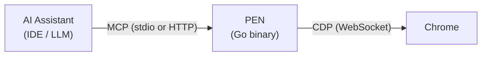

# PEN

MCP server for browser performance profiling. Tell your AI to profile a page, hunt down a memory leak, or check code coverage — PEN does the DevTools work and hands back structured results.

One Go binary. No Node.js. No browser launch. Just attach to your running browser.

## How It Works



Your editor spawns PEN as a child process. When the LLM calls something like `pen_heap_snapshot`, PEN fires the right Chrome DevTools Protocol commands, streams data to disk, and sends back analysis the LLM can act on.

## What You Can Do

| Category       | What it does                                                           | Tools   |
| -------------- | ---------------------------------------------------------------------- | ------- |
| **Memory**     | Heap snapshots, snapshot diffs for leak detection, allocation tracking | 4 tools |
| **CPU**        | CPU profiling, Chrome traces, offline trace analysis                   | 3 tools |
| **Network**    | Request capture, waterfall, render-blocking detection                  | 4 tools |
| **Coverage**   | JS and CSS coverage with unused byte breakdown                         | 2 tools |
| **Audit**      | Performance metrics, Core Web Vitals, accessibility                    | 3 tools |
| **Source**     | List scripts, grab source, search across all loaded scripts            | 3 tools |
| **Console**    | Live console capture and filtering                                     | 2 tools |
| **Lighthouse** | Full Lighthouse audits (needs the CLI)                                 | 1 tool  |
| **Utility**    | Navigation, screenshots, eval, device emulation, tab switching         | 8 tools |

30 tools total. See the full [Tool Reference](/docs/tool-catalog).

## Quick Start

```bash
# Install
curl -fsSL https://raw.githubusercontent.com/edbnme/pen/main/install.sh | sh

# Interactive setup wizard
pen init
```

`pen init` detects your browser and IDE, writes the MCP config, and verifies the connection.

Or install via package managers:

```bash
brew install edbnme/tap/pen    # macOS / Linux
scoop bucket add pen https://github.com/edbnme/scoop-pen && scoop install pen  # Windows
```

Full install guide: [Installation](/docs/install)

## Example

Ask your AI assistant:

> _"Check the performance metrics of this page"_

PEN connects to Chrome, runs `pen_performance_metrics` via CDP, and returns:

```
┌ Performance Metrics
│ Metric              │ Value    │ Status
│ JSHeapUsedSize      │ 82.4 MB  │ ⚠ High
│ Nodes               │ 4,521    │
│ LayoutCount         │ 12       │
│ RecalcStyleCount    │ 8        │
│ ScriptDuration      │ 1.23s    │ ⚠ Slow
└
```

The LLM spots the high heap and slow scripts, then suggests fixes. You never open DevTools.

## Key Design Decisions

| Decision       | Choice                     | Why                                                             |
| -------------- | -------------------------- | --------------------------------------------------------------- |
| Language       | Go 1.24                    | Single binary, chromedp + MCP Go SDK                            |
| Transport      | stdio (default), HTTP      | stdio for IDE spawning; HTTP for shared/remote                  |
| CDP            | Attach to existing browser | Never launches a browser — your dev browser is already running  |
| Large payloads | Stream to disk             | Heap snapshots can exceed 1 GB; PEN uses constant memory        |
| Security       | Layered gates              | Eval gating, expression blocklist, path validation, rate limits |

## vs chrome-devtools-mcp

Google maintains [`chrome-devtools-mcp`](https://github.com/ChromeDevTools/chrome-devtools-mcp) — a general DevTools MCP server for navigation, DOM, screenshots, network, traces, memory, and Lighthouse.

PEN is built for performance work: multi-snapshot heap diffs for leak detection, streaming for multi-GB payloads, no Node.js runtime, and every tool aimed at "why is this slow?" rather than "what's on the page?". They complement each other.

## Docs

| Section                                  | Description                                    |
| ---------------------------------------- | ---------------------------------------------- |
| [Installation](/docs/install)            | Install, browser setup, IDE config, `pen init` |
| [Running PEN](/docs/running)             | Flags, Docker, server deploys                  |
| [Tool Reference](/docs/tool-catalog)     | Every tool's params and output                 |
| [Workflows](/docs/workflows)             | Common tool chains and recipes                 |
| [Troubleshooting](/docs/troubleshooting) | Common issues and fixes                        |
| [Security](/docs/security)               | Threat model and defenses                      |
| [Architecture](/docs/architecture)       | System design (for contributors)               |
