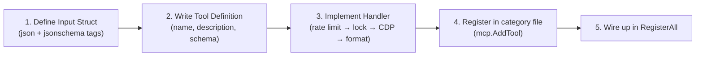

# Adding Tools

Guide for adding new tools to PEN. Every tool follows the same pattern — this guide walks through it with a real example.



## Architecture

Tools live in `internal/tools/`. Each file covers one category:

| File            | Category    | Tools                                                                                        |
| --------------- | ----------- | -------------------------------------------------------------------------------------------- |
| `audit.go`      | Performance | `pen_performance_metrics`, `pen_web_vitals`, `pen_accessibility_check`                       |
| `memory.go`     | Memory      | `pen_heap_snapshot`, `pen_heap_diff`, `pen_heap_track`, `pen_heap_sampling`                  |
| `cpu.go`        | CPU         | `pen_cpu_profile`, `pen_capture_trace`, `pen_trace_insights`                                 |
| `network.go`    | Network     | `pen_network_enable`, `pen_network_waterfall`, `pen_network_request`, `pen_network_blocking` |
| `coverage.go`   | Coverage    | `pen_js_coverage`, `pen_css_coverage`                                                        |
| `source.go`     | Source      | `pen_list_sources`, `pen_source_content`, `pen_search_source`                                |
| `console.go`    | Console     | `pen_console_enable`, `pen_console_messages`                                                 |
| `lighthouse.go` | Lighthouse  | `pen_lighthouse`                                                                             |
| `utility.go`    | Utility     | 8 tools (navigation, screenshots, eval, etc.)                                                |
| `status.go`     | Status      | `pen_status`                                                                                 |

`register.go` has the `RegisterAll` entry point and the `Deps` struct.

## Step 1: Define the Input Struct

Create a Go struct with `json` and `jsonschema` tags. The MCP SDK auto-generates `inputSchema` from these.

```go
type myToolInput struct {
    Duration int    `json:"duration" jsonschema:"description=Duration in seconds (1-30),minimum=1,maximum=30"`
    Format   string `json:"format"   jsonschema:"description=Output format,enum=brief,enum=detailed"`
    TopN     int    `json:"topN"     jsonschema:"description=Number of top items to return"`
}
```

For tools with no parameters, use an empty struct:

```go
type perfMetricsInput struct{}
```

## Step 2: Define the Tool

Create an `mcp.Tool` definition with name, description, and annotations:

```go
var myTool = mcp.Tool{
    Name:        "pen_my_tool",
    Description: "What this tool does in one sentence. Used by LLMs to decide when to call it.",
    Annotations: &mcp.ToolAnnotations{
        ReadOnlyHint: boolPtr(true), // or false if it modifies state
    },
}
```

All PEN tools are prefixed with `pen_`. The description is shown to the LLM in `tools/list` — make it clear and actionable.

## Step 3: Write the Handler

Handler signature (using Go generics):

```go
func handleMyTool(deps *Deps) func(context.Context, *mcp.CallToolRequest, myToolInput) (*mcp.CallToolResult, any, error) {
    return func(ctx context.Context, req *mcp.CallToolRequest, input myToolInput) (*mcp.CallToolResult, any, error) {
        // 1. Rate limit check (if this is a heavy operation)
        if err := deps.Limiter.Check("pen_my_tool"); err != nil {
            return toolError(err.Error())
        }

        // 2. Acquire domain lock (if using an exclusive CDP domain)
        release, err := deps.Locks.Acquire("MyDomain")
        if err != nil {
            return toolError("MyDomain is already in use by another operation")
        }
        defer release()

        // 3. Get chromedp context
        cdpCtx, cancel, err := deps.CDP.ContextWithTimeout(30 * time.Second)
        if err != nil {
            return toolError(err.Error())
        }
        defer cancel()

        // 4. Do CDP work
        // ...

        // 5. Format output
        out := format.ToolResult("My Tool",
            format.Section("Results",
                format.Table(headers, rows),
            ),
        )

        // 6. Record rate limit (after success)
        deps.Limiter.Record("pen_my_tool")

        return &mcp.CallToolResult{
            Content: []mcp.Content{
                &mcp.TextContent{Text: out},
            },
        }, nil, nil
    }
}
```

### Error Handling

Use `toolError` for expected errors (user-facing):

```go
func toolError(msg string) (*mcp.CallToolResult, any, error) {
    return nil, nil, errors.New(msg)
}
```

The SDK sets `isError: true` automatically. Write error messages for LLM consumption — explain what happened, why, and what to do next.

### Progress Notifications

For long-running operations, send progress:

```go
server.NotifyProgress(ctx, req, bytesWritten, totalBytes, "processing...")
```

Safe to call unconditionally — no-ops if no progress token.

## Step 4: Register the Tool

Add registration to the appropriate `register*Tools` function, or create a new one:

```go
func registerMyTools(s *mcp.Server, deps *Deps) {
    mcp.AddTool(s, myTool, handleMyTool(deps))
}
```

Then add the call in `RegisterAll`:

```go
func RegisterAll(s *mcp.Server, deps *Deps) {
    registerMemoryTools(s, deps)
    registerCPUTools(s, deps)
    // ...
    registerMyTools(s, deps)  // add this
}
```

## Step 5: Add Rate Limiting (Optional)

If the tool is expensive, add a cooldown in `security/ratelimit.go`:

```go
var DefaultCooldowns = map[string]time.Duration{
    "pen_heap_snapshot":   10 * time.Second,
    "pen_capture_trace":   5 * time.Second,
    "pen_collect_garbage": 5 * time.Second,
    "pen_my_tool":         5 * time.Second,  // add this
}
```

## Step 6: Write Tests

Add tests in `tools/tools_test.go` or create a new test file. Tests use the MCP SDK's test helpers to exercise tools without a real browser.

## Patterns to Follow

### Output Formatting

Always use `format.ToolResult` and `format.Table` for consistent output:

```go
out := format.ToolResult("Tool Name",
    format.Section("Summary",
        format.Summary([][2]string{
            {"Total", fmt.Sprintf("%d items", len(items))},
            {"Duration", format.Duration(elapsed)},
        }),
    ),
    format.Section("Details",
        format.Table(
            []string{"Name", "Value", "Status"},
            rows,
        ),
    ),
)
```

### Temp Files

For operations that produce large output:

```go
f, err := security.CreateSecureTempFile("mytool-")
if err != nil {
    return toolError(err.Error())
}
defer os.Remove(f.Name())
defer f.Close()
```

### Domain Locking

Use `OperationLock` for exclusive CDP domains:

```go
release, err := deps.Locks.Acquire("DomainName")
if err != nil {
    return toolError("DomainName is already in use")
}
defer release()
```

### Context Timeout

Always add a timeout to CDP operations:

```go
cdpCtx, cancel, err := deps.CDP.ContextWithTimeout(30 * time.Second)
if err != nil {
    return toolError(err.Error())
}
defer cancel()
```

### Defaults

Apply defaults for optional parameters:

```go
topN := input.TopN
if topN <= 0 {
    topN = 20
}
```

## Checklist

Before submitting a new tool:

- [ ] Input struct has `json` and `jsonschema` tags
- [ ] Tool name starts with `pen_`
- [ ] Description is clear and LLM-friendly
- [ ] Handler checks rate limit (if heavy)
- [ ] Handler acquires domain lock (if exclusive)
- [ ] Handler uses `defer` for cleanup (locks, temp files, contexts)
- [ ] Output uses `format.ToolResult` for consistent formatting
- [ ] Error messages are LLM-readable (what happened, why, what to do)
- [ ] Tests cover the happy path and key error cases
