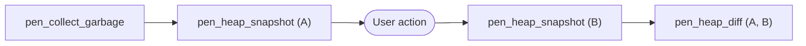
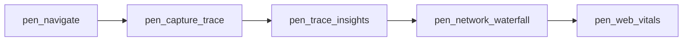
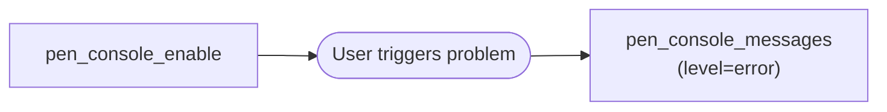
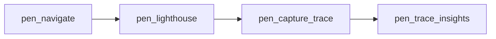
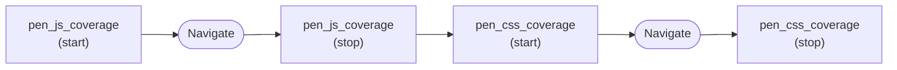
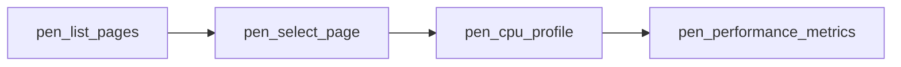
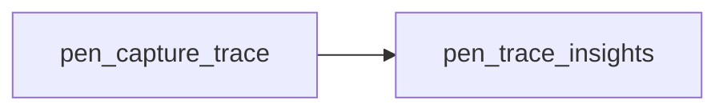
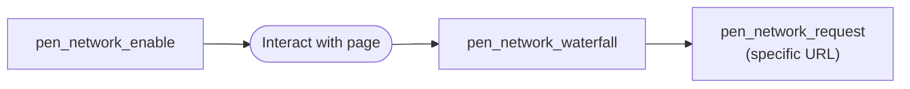
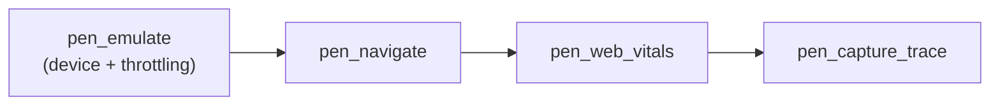
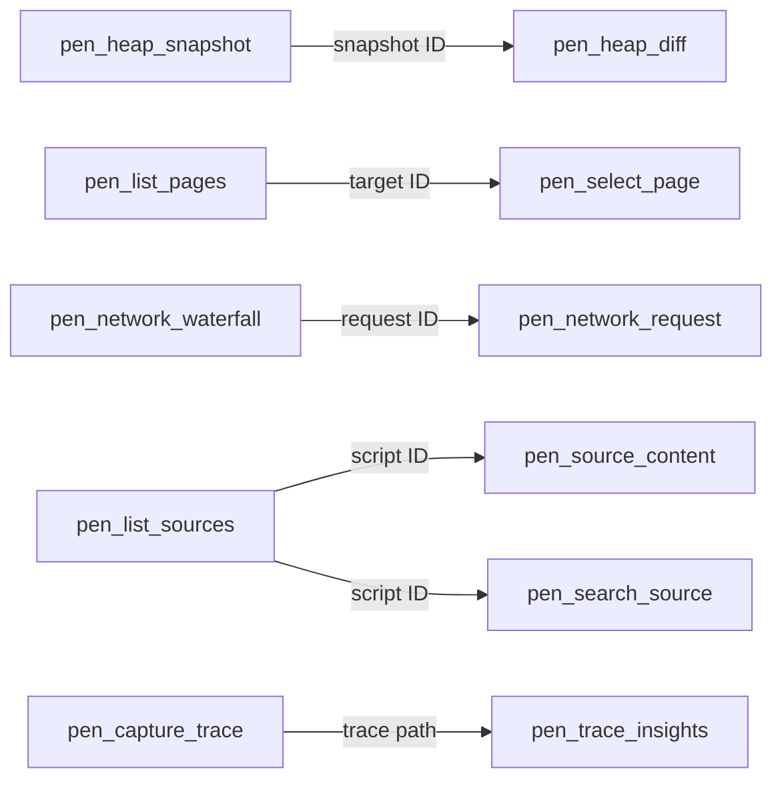

# Workflows

PEN tools are designed to chain. The LLM drives the composition — PEN doesn't enforce workflows. These are proven patterns for common performance investigations.

## Memory Leak Investigation

1. Force GC to get a clean baseline
2. Take snapshot A
3. Have the user reproduce the suspected leak (navigate, open/close a modal, etc.)
4. Take snapshot B
5. Diff the two snapshots — PEN shows new objects, grown objects, and total delta

The diff output highlights retained objects that grew between snapshots, which are your leak candidates. The LLM can then suggest the root cause based on the object types and retainer chains.

> **Tip:** For allocation tracking over time (without two manual snapshots), use `pen_heap_track` with `action: "start"`, reproduce the issue, then `action: "stop"`.

## Page Load Optimization

1. Navigate to the target page
2. Capture a Chrome trace during load
3. Analyze the trace for long tasks (>50ms), LCP, CLS, and slow resources
4. Check the network waterfall for large assets, slow requests, and render-blocking resources
5. Measure Core Web Vitals for the final score

This gives the LLM a complete picture: trace-level timing, network bottlenecks, and the actual Web Vitals numbers all in one flow.

## Console Debugging

1. Start console capture to wire up the CDP listener
2. Have the user reproduce the issue
3. Pull error messages — filtering by `level=error` keeps noise down

Console messages include source URLs, line numbers, and stack traces for exceptions. The buffer holds up to 1,000 messages; oldest 100 are evicted when full.

## Full Page Audit

1. Navigate to the page
2. Run Lighthouse for a high-level score (performance, accessibility, SEO, best practices)
3. Capture a trace for the detailed timeline
4. Analyze the trace to pinpoint exactly what Lighthouse flagged

Lighthouse tells you _what's wrong_; trace insights tell you _why_ and _where_ in the execution timeline.

## Bundle Audit

1. Start JS coverage
2. Navigate to the page (full page load)
3. Stop JS coverage — see which scripts have the most unused bytes
4. Repeat for CSS coverage

This identifies dead code. The LLM can recommend code splitting or tree-shaking based on the unused byte percentages.

## Multi-Tab Profiling

1. List all browser tabs
2. Switch to the target tab
3. Profile CPU on that tab
4. Grab performance metrics

Useful when your app spans multiple tabs or you need to compare performance across different pages.

## Trace-Driven Analysis

Capture a raw trace file, then hand it to `pen_trace_insights` for a structured breakdown. No need to leave the MCP conversation to analyze the trace manually. The insights include:

- Long tasks (>50ms threshold)
- Layout shifts (CLS contributors)
- Largest Contentful Paint timing
- Slowest resources
- Frame timing and dropped frames (>33.3ms = below 30fps)

## Network Performance

1. Enable network capture (optionally disable cache)
2. Interact with the page — navigate, click, scroll
3. View the waterfall to spot slow requests, large assets, or 4xx/5xx errors
4. Drill into a specific request for full headers, timing, and body details

## Device Simulation

1. Set device emulation (e.g., iPhone 14 with 4G network + 4x CPU throttle)
2. Navigate to the page
3. Measure Web Vitals under throttled conditions
4. Capture a trace to see what's slow on constrained hardware

Network presets: `3G` (563ms latency, 188KB/s down), `4G` (170ms, 500KB/s), `WiFi` (2ms, 3.75MB/s).

## Tool ID Flow

Some tools produce IDs consumed by downstream tools:

| Producer                | ID Type     | Consumer                                  |
| ----------------------- | ----------- | ----------------------------------------- |
| `pen_heap_snapshot`     | snapshot ID | `pen_heap_diff`                           |
| `pen_list_pages`        | target ID   | `pen_select_page`                         |
| `pen_network_waterfall` | request ID  | `pen_network_request`                     |
| `pen_list_sources`      | script ID   | `pen_source_content`, `pen_search_source` |
| `pen_capture_trace`     | trace path  | `pen_trace_insights`                      |

IDs are opaque strings (or file paths for traces). They remain valid until PEN restarts or the referenced resource is destroyed (tab closed, page navigated, etc.).
